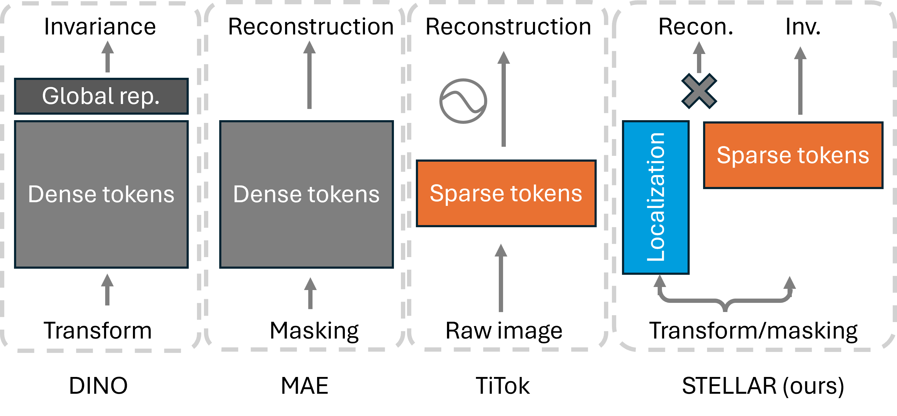

# **STELLAR**

[[`Paper`](https://arxiv.org/abs/2602.01905)] [[`BibTeX`](#Citation)]

This repository hosts the code and resources for **STELLAR**, aka "Learning Sparse Visual Representations via Spatial-Semantic Factorization". **STELLAR** is produce unified sparse vision representation supporting both **reconstruction** (2.60 FID) and **semantics** (79.10% linear probing accuracy), with 90% reduction in the latent size compared to dense grid (only 16 tokens). By factorizing "what" from "where", STELLAR effectively models the multiple semantic concepts in an image along with their spatial localization, enabling efficient, holistic vision representation.

## How it Works

STELLAR learns a factorized latent representation. By doing so it effectively learns the "semantic" part disentangled from the "spatial" part, allowing the joint learning of reconstruction and semantics. Below we compare different types of SSL methods.



## Unified Representation
The latent representation learned from STELLAR can serve both high-level semantics and image reconstruction. Below we show the reconstruction potention by training a light-weight 6-layer ViT decoder on top of frozen features (* TiTok used its own larger ViT decoder). We probe the semantic quality with linear probing and kNN. 

| | | Reconstruction | | Semantics | |
| :--- | :--- | :--- | :--- | :--- | :--- |
| **Model** | **# tokens** | **FID ↓** | **LPIPS ↓** | **Lin.** | **kNN** |
| DINO | 1 | - | - | 76.46 | 74.69 |
| DINO | 196 | 3.27 | 0.2121 | 70.31 | 54.41 |
| MAE | 196 | 3.02 | **0.2071** | 66.32 | 25.82 |
| TiTok* | 32 | 2.75 | 0.3281 | 33.42 | 7.30 |
| TiTok* | 64 | 1.99 | 0.2571 | 32.87 | 7.29 |
| **STELLAR** | **16** | **3.06** | **0.2077** | **73.26** | **67.25** |
| **STELLAR** | **196** | **2.85** | **0.2085** | **72.21** | **64.71** |
| **STELLAR (H)** | **16** | **2.60** | **0.1729** | **79.10** | **77.31** |


## Installation
```sh
git clone https://github.com/microsoft/STELLAR.git
```

### Conda Environment Setup
```sh
conda create -n stellar python=3.10.14
conda activate stellar
```

Install dependencies
```sh
pip install -r requirements.txt 

pip install azureml-automl-core
pip install opencv-python
```

## Model Weights
Pretrained odel weights will be made availabe soon.

## Model Training

```bash
python -m azureml.acft.image.components.olympus.app.main \
  --config-path <YOUR ABSOLUTE CONFIG DIRECTORY PATH> \
  --config-name stellar
```


## Citation

If you find our paper/code interesting and helpful for your research, please consider citing:

```bibtex
@article{zhao2026stellar,
      title={Learning Sparse Visual Representations via Spatial-Semantic Factorization}, 
      author={Theodore Zhengde Zhao and Sid Kiblawi and Jianwei Yang and Naoto Usuyama and Reuben Tan and Noel C Codella and Tristan Naumann and Hoifung Poon and Mu Wei},
      year={2026},
      eprint={2602.01905},
      archivePrefix={arXiv},
      primaryClass={cs.CV},
      url={https://arxiv.org/abs/2602.01905}, 
}
```

## Usage and License Notices
The model described in this repository is provided for research and development use only. 